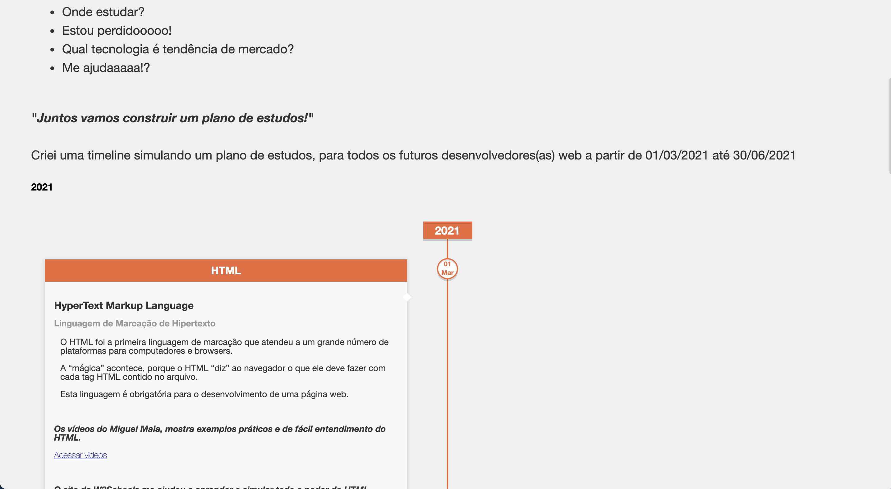
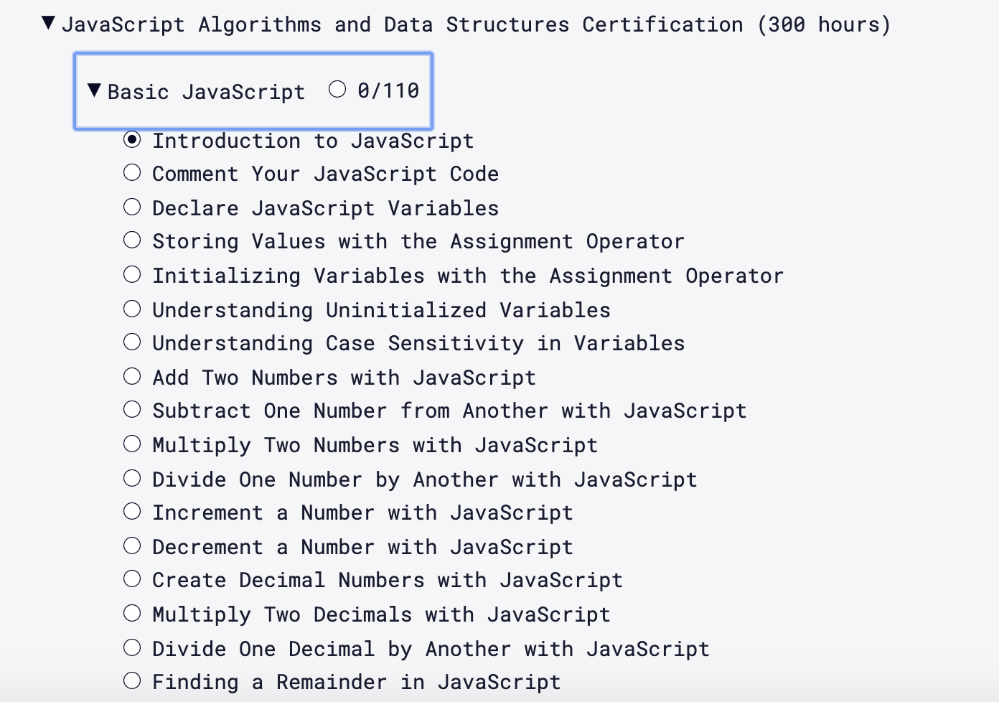
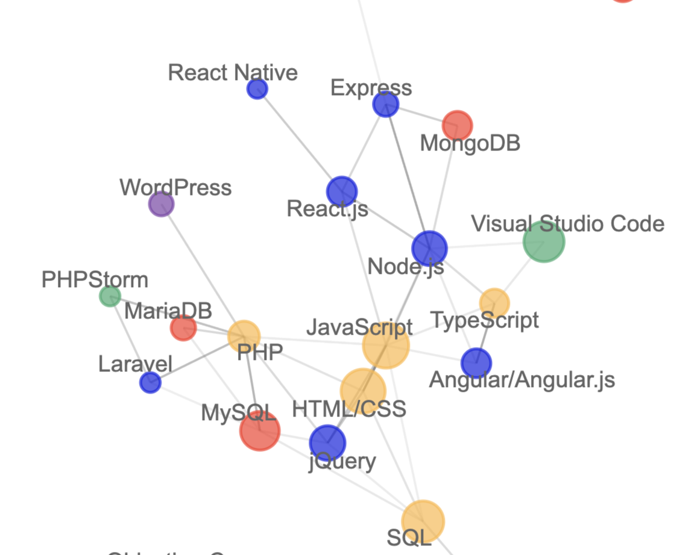
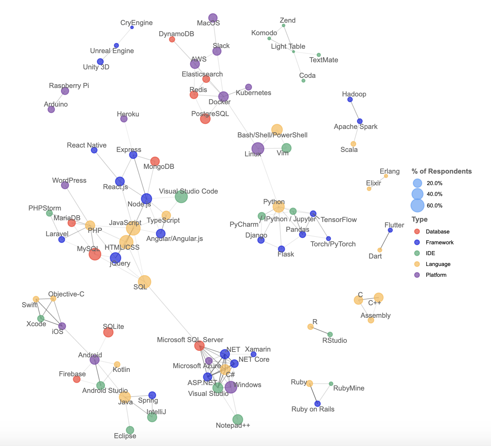
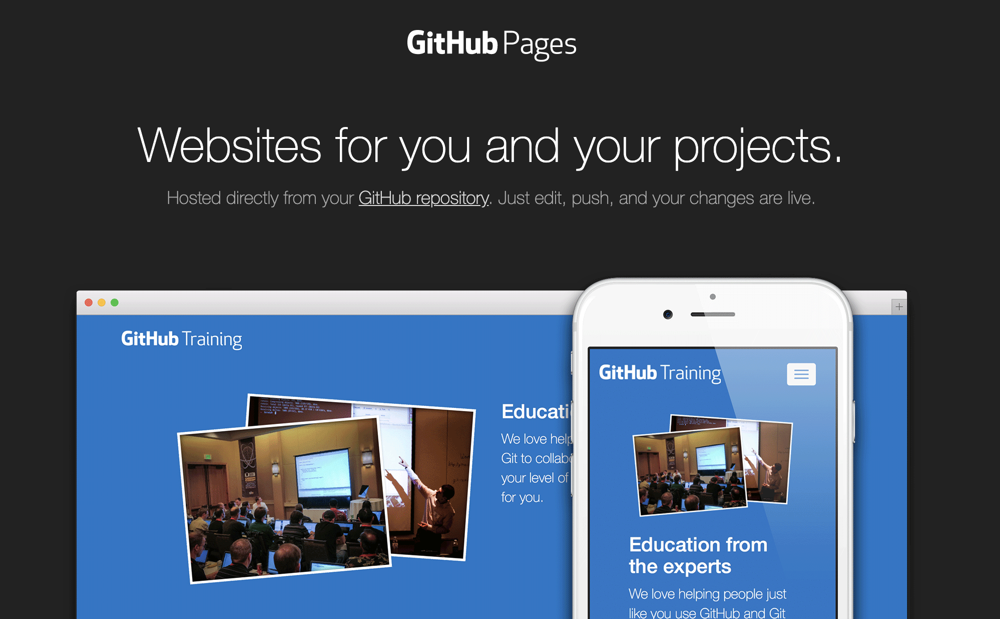

# Become a full stack developer

> Clique :star: Se você gostou desse projeto. Pull Request será muito apreciado. 

### Table of Contents

| No. | Questions |
|---- | ---------
|1 | [Dias 1 Aprender o básico sobre internet](#dia-1-internet)|
|2 | [Dias 2-15 Aprender o básico de HTML E CSS](#dias-2-15-aprender-o-básico-de-html-e-css)|
|3 | [Dias 16-50 Comece aprender o básico de Javascript?](#dias-16-50-comece-aprender-o-básico-de-javascript)|
|4 | [Dias 51-81 30 Dias de desafios Javascript](#dias-51-81-30-dias-de-desafios-javascript)|
|5 | [Dias 82-85 Git](#dias-82-85-git)|
|6 | [Dias 85-120 Aprenda algum framework ou biblioteca](#dias-85-120-aprenda-algum-framework-ou-biblioteca)|
|7 | [Dias 120-122 Rest](#dias-120-122-rest)|
|8 | [Dias 122-130 Orientação a objetos e Programação Funcional](#dias-122-130-orientação-a-objetos-e-programação-funcional)|
|9 | [Dias 130-190 Aprender node, mongoDB e PostgreSQL(Backend development)](#dias-130-190-aprender-node-mongodb-e-postgresql-backend-development)|
|10 | [Dias 190-200 Aprender DevOps e GIT(Docker, Heroku, AWS, Kubernets)](#dias-190-200-aprender-devops-e-git-docker-heroku-aws-kubernets)|
|11 | [Dia 201 Bonus](#dia-201-bonus)|
|12 | [Dia 200+ Bonus](#dia-200+)|

Essa rota vai levar você pelos caminhos de um desenvolvedor full stack em 200 dias. Eu sou um programador autodita, estou aprendendo todos os dias. Meu primeiro contato com o mundo de TI, a programação em si, foi quando eu tinha 17 anos, na faculdade de sistemas de informação. Porque esse é um caminho full stack? E não focado em como se tornar um desenvolvedor web ou backend? A nossa missão será no final deste caminho, que você entenda sobre ambas as áreas, que envolvem o todo, "mas eu não gosto de front-end, não gosto de css", "eu não sou desenvolvedor backend, não nasci pra isso, java, deus me livre", você vai ouvir muito disso no seu caminho, até mesmo você pode ter falado algo parecido. Não é certo que em 200 dias você será um dev full stack, isso depende do seu empenho e tempo de aprendizado, não force isso!

"Eu poderia fazer um bootcamp de 60 dias e se desenvolvedor fullstack"

Não defendo a programação de botcamps, eles provaram ser eficazes. Eles também provaram ser muito caros e ineficazes.

Tudo que usaremos nessa rota, será gratuito.

"This is the way" - the mandalorian 

The best way to predict the future is to create it."
                       - Abraham Lincoln 👍

Deixarei uma iniciativa do Breno Machado, ele tem uma timeline de uma pessoa desenvolvedora web, com vários conteúdos gratuítos.

- [AJUDA DEV](http://ajudadev.com.br/)

### Antes de começar
 
Iremos ver um roadmap front-end, ok ok, é só pra ter uma overview do que iremos estudar, tentarei seguir o mais fiel possível esse roadmap.

para mais roadmaps acesse - [ROADMAP](https://roadmap.sh/) 

### Dia 1 Internet

Antes de mais nada, assista esse vídeo do Filipe Deschamps, esse vídeo é extremamente especial para quem está começando.
- [Minha carreira teria sido muito melhor](https://www.youtube.com/watch?v=NA4srP35Maw&ab_channel=FilipeDeschamps, "Minha carreira teria sido muito melhor")
- [How does the internet work](https://developer.mozilla.org/pt-BR/docs/Learn/Common_questions/How_does_the_Internet_work "Como a internet funciona")
- [What is HTTP](https://developer.mozilla.org/pt-BR/docs/Web/HTTP/Overview, "O que é HTTP")
- [What is a browser](https://www.mozilla.org/pt-BR/firefox/browsers/what-is-a-browser/, "O que é um browser")
- [How browsers work](https://www.html5rocks.com/pt/tutorials/internals/howbrowserswork/#Introduction, "Como os browser trabalham")

Esse tutorial acima, traz uma abordagem de como o software "navegador" funciona, apresenta os mecanismos de renderização, DOM, HTML, recomendo a leitura mas, tem muita informação para quem está começando. Sugiro também assistir esse vídeo do canal Alura no youtube. 

- [Como funcionam os navegadores Web?](https://www.youtube.com/watch?v=kDy62zaCHZE&ab_channel=AluraCursosOnline, "Como funcionam os navegadores web")
- [O que é DNS](https://blog.diferencialti.com.br/servidor-dns/#:~:text=Basicamente%2C%20o%20DNS%20permite%20que,qual%20a%20p%C3%A1gina%20est%C3%A1%20armazenada, "O que é DNS")
- [DNS: o que é, como funciona e como configurar o DNS de um domínio](https://rockcontent.com/br/blog/dns/, "DNS: o que é, como funciona e como configurar o DNS de um domínio")

Um vídeo ótimo, objetivo, claro e dinãmico sobre o tema DNS 
- [O que é DNS? Como funciona? Domain Name System](https://www.youtube.com/watch?v=2zqGtfVGABU&ab_channel=CanalTI, "O que é DNS")

### Dias 2-15 Aprender o básico de HTML E CSS

Esse é o inicio da sua jornada, é crucial focar nos fundamentos. É um inicio pequeno, aprender Hypertext Markup Language (Linguagem de Marcação de texto, HTML). HTML é usado para construir qualquer bloco de código em qualquer web application. Complementando a skill, aprender Cascading Style Sheets (CSS). Css é usado para estilizar website e web applications. (Passar uma maquiagem Hahaha).

Antes de começar vou te apresentar uma ferramenta incrível que vai te ajudar muito nos seus dias como programador web, o famoso "Inspecionar", aqui mesmo clique com o botão direito na tela e clique em inspecionar, vai ser aberto para você algo semelhante a isso, tudo vai depender do seu navegador.

- [Começando com a web](https://developer.mozilla.org/pt-BR/docs/Aprender/Getting_started_with_the_web "Começando com a web")
- [Como a web funciona](https://developer.mozilla.org/pt-BR/docs/Learn/Getting_started_with_the_web/How_the_Web_works, "Como a web funciona")
- [Instalando programas básicos](https://developer.mozilla.org/pt-BR/docs/Aprender/Getting_started_with_the_web/instalando_programas_basicos "Instalando programas básicos")
- [Com o que seu site vai parecer](https://developer.mozilla.org/pt-BR/docs/Aprender/Getting_started_with_the_web/com_que_seu_site_vai_parecer, "Com o que seu site vai parecer")
- [Lidando com arquivos](https://developer.mozilla.org/pt-BR/docs/Aprender/Getting_started_with_the_web/lidando_com_arquivos, "Lidando com arquivos")
- [Básico de HTML](https://developer.mozilla.org/pt-BR/docs/Aprender/Getting_started_with_the_web/HTML_basico, "Básico de HTML")
- [Básico de CSS](https://developer.mozilla.org/pt-BR/docs/Aprender/Getting_started_with_the_web/CSS_basico, "Básico de CSS")
- [Publicando seu site](https://developer.mozilla.org/pt-BR/docs/Aprender/Getting_started_with_the_web/Publicando_seu_site, "Publicando seu site")
- [Como a web funciona](https://developer.mozilla.org/pt-BR/docs/Aprender/Getting_started_with_the_web/Como_a_Web_funciona, "Como a web funciona")

### BONUS 

- [O que é css e guia básicos](https://www.hostinger.com.br/tutoriais/o-que-e-css-guia-basico-de-css/#Cursos-sobre-CSS)
- [O que é html e conceitos básicos](https://www.hostinger.com.br/tutoriais/o-que-e-html-conceitos-basicos/)
- [O que é html](https://www.weblink.com.br/blog/o-que-e-html/)

É um monte de trabalho para criar um site profissional, se você está iniciando agora com desenvolvimento web, eu encorajo você começear pequeno. Se você não está querendo construir o próximo facebook agora, recomendo você não pegar tão pesado, comece com o simples.

Ok ok, é muita teoria né? Vamos por a mão na massa?!

### CHALLENGE 

- [100 Dias com CSS](https://100dayscss.com/)
- [Escolha algum template e faça](https://codier.io/)

### Dias 16-50 Comece aprender o básico de Javascript

Javascript é a linguagem de programação mais popular, com dezenas de framework. Javascript é a linguagem de programação mais difundida, todo website usa. Se você usa algum browser moderno desative o javascript e navegue na Web, você notará muito rapidamente que 97% dos sites não funcionarão corretamente ou nem serão carregados.

Por ser tão popular, temos muitos lugares para aprender Javascript gratuitamente, citarei alguns abaixo

- [Básico de JS](https://developer.mozilla.org/pt-BR/docs/Aprender/Getting_started_with_the_web/JavaScript_basico, "Básico de Javascript")

Interativo e com vários desafios para resolver.

[FreeCodeCamp JavaScript curriculum](https://www.freecodecamp.org/learn)

Muitos não tem o hábito de ler, mas é essencial estudar com algum livro, leia os livros e só passe para o próximo assunto após entender, e além de tudo faça todos os exercícios.

- [JavaScript Eloquente 2ª Edição (gratuito)](https://github.com/braziljs/eloquente-javascript)
- [You Don’t Know JS (gratuito)](https://github.com/getify/You-Dont-Know-JS)

### Dias 51-81 30 Dias de desafios Javascript
30 dias de desafios javascript é do iniciante para intermediario, ou pra quem se sentir confortável com javascript

Você deve saber um pouco de js para começar, lembrando que esse não é um curso de javascript, aprendemos com a mão na massa, fazendo. Você vai enfrentar muitas situações novas e conversando sobre os comos, os porquês e o que usamos para resolvê-los.

Ok, você percebeu que evitamos bibliotecas, padrões de design, estruturas e qualquer tipo de abstração? Essas coisas são ótimas e frequentemente necessárias. Mas podem obstruir o aprendizado e restringir o entendimento inicial. Hoje acontece muito com os novos desenvolvedores eles vão direto para os frameworks, exemplo: Angular, mas sem saber Javascript, o básico, vão direto usar boostrap sem entender css, sem entender o que está acontecendo por trás, é realmente importante antes de iniciar em qualquer bibliotecas, frameworks, padrões de design, entender o básico e saber o que acontece por de baixo dos panos, nunca se sabe quando vai precisar mudar algo não é mesmo?

Esses tutoriais dependem muito das APIS do navegador, a maioria das quais envolve interação com a página. Se você estiver preso no console, console.log(), esses vídeos serão o próximo passo. O material que você constrói aqui é realmente divertido.

O curso é gratuito, diverto e desafiador ao longo de 30 dias, todo dia você irá receber um novo desafio para construir, quando você concluir o curso, você deverá se sentir à vontade com Javascript, interagindo com o DOM e trabalhando com as APIs do navegador.

### Dias 82-85 Git

É essencial nas skills de um desenvolvedor entender sobre o git, é uma coisa simples e você precisa dominar.

Por que é necessário? Git é um sistema de controle de versionamento de arquivos, através dele os desenvolvedores podem compartilhar os projetos na qual diversas pessoas podem contribuir simultaneamente no mesmo, editando e criando novos arquivos, permitindo que os dois exitam sem risco de alterações sobrescristas e com histórico.

- [Tutorial de git básico e introdução](https://www.hostinger.com.br/tutoriais/tutorial-do-git-basics-introducao/)
- [Git guide](https://rogerdudler.github.io/git-guide/index.pt_BR.html)
- [Plano para estudar git e github](https://medium.com/trainingcenter/plano-para-estudar-git-e-github-enquanto-aprende-programa%C3%A7%C3%A3o-f5d5f986f459)
- [Curso de git gratuito](https://www.udemy.com/course/git-e-github-para-iniciantes/)

Os próximos códigos que você desenvolver ou projeto, crie um repositorio privado e faça alguns commits e matenha o código versonado e não faça commits com mensagens inúteis ou **zoados", o histórico é o seu melhor amigo, então tente manter sempre o mais objetivo possível.

### Dias 85-120 Aprenda algum framework ou biblioteca

Primeiro de tudo, não saia já procurando algum curso na udemy, no google, nem nada. Calma na alma. Pergunte a qualquer empresa competitiva, uma software house, se eles estão usando algum tipo de biblioteca de front-end e a resposta será sim. Nos velhos tempos (2000), as empresas arregaçavam as mangas e construíam as suas estruturas próprias e bibliotecas internas adaptadas às suas necessidades. O desenvolviment moderno é sobre o uso de estruturas e bibliotecas de código fonte aberto, como React, Vue, Angular.

Lembro quando trabalhei em uma empresa em brasília, usamos tecnologias de 2006-2007, sistemas legados e novos sistemas sendo construídos em cima deles, nada de inovação. Meu conhecimento ficou estagnado e eu pensando que seria só no inicio da carreira, recentemente fui pra uma empresa com seu próprio ERP, usavam Java 6, sem nenhum framework, 10 meses de tortura, por que tortura? Fiquei aquem do conhecimento, do mercado, desatualizado, quando decidi buscar uma nova oportunidade, tive que atualizar vários dos meus conhecimentos, além se eu tivesse continuado nessa empresa, estaria refém das suas tecnologias. 

O que aprendi com essas lições? Busque sempre algo que te motive e trabalhe com o que você gosta, essa é a essência.

É difícil decidir qual framework começar, você tem tantas opções

Lembre-se, seu objetivo é achar uma vaga de desenvolvedor, procure algumas vagas na sua cidade,olhe o que estão precisando, qual framework, outro meio entre em [Vagas Front-end](https://github.com/frontendbr) de uma olhada nas vagas em aberto, olhe as skills necessárias e foque nelas, foque em uma vaga. 

**Note: React é uma biblioteca Javascript para construir UI, aprenda react no site oficial.**

Temos um gráfico abaixo de desenvolvimento web e como suas tecnologias estão conectadas

Após você escolher um framework, antes de sair construindo coisas por ai, entre no site oficial do framework e faça o tutorial passo a passo até o fim, comece do básico, react, vue, angular, todos tem tutorials de início e todos com bastante conceitos e ensinamentos.

- [Angular](https://angular.io/)
- [React](https://pt-br.reactjs.org/)    
- [Vue](https://br.vuejs.org/index.html)

Agora que você já fez o tutorial de start, saia por ai construindo coisas aqui tem 6 desafios pra você começar, [desafios](https://medium.com/better-programming/here-are-6-frontend-challenges-to-code-9952190c97cc).

Se você precisar de ajuda, você a todo momento pode ir na comunidade do github,stackOverflow, ou grupos no telegram, tem vários, muitas pessoas estão lá a todo momento. **You're never alone** (Você nunca está sozinho).

**Lembre-se this is the way**

Se você escolhe react, aqui está um livro gratuito [The road to learn react portuguese](https://github.com/the-road-to-learn-react/the-road-to-learn-react-portuguese) Recomendo fortemente esse livro, será de ótima ajuda em sua jornada com conceitos básicos e um ótimo início.

Aqui vai um repositório com perguntas e respostas da pra aprender bastante também.
- [Reactjs questões de entrevista](https://github.com/pedrincandido/reactjs-questoes-de-entrevista)
- [Angular questões de entrevista](https://github.com/pedrincandido/angular-questoes-entrevista)

### Dias 120-122 Rest
Representational State Transfer(Transferência Representacional de Estado), é um estilo de arquitetura de software que define um conjunto de restrições a serem usados para criação de web services.
- [Rest Principios e boas práticas](https://blog.caelum.com.br/rest-principios-e-boas-praticas/)
- [O que é api rest e restful](https://becode.com.br/o-que-e-api-rest-e-restful/)
- [Rest](https://www.youtube.com/watch?v=S7MduKwvVGk)

### Dias 122-130 Orientação a objetos e Programação Funcional
Programação orientada a objetos(POO ou OOP) é um paradigma de programação baseado no conceito de "objetos".

Programação funcional é um paradigma de programação que trata a computação como uma avaliação de funções matemáticas.

[Programação Funcional](https://www.youtube.com/watch?v=BxbHGPivjdc)

Esses temas tem bastante material na internet, então de uma procurada.

### Dias 130-190 Aprender node, mongoDB e PostgreSQL(Backend development)
Você chegou até aqui já, desistir não é uma opção. Agora que aprendemos como o desenvolvimento de front-end funciona, vamos adicionar algum conhecimento de back-end à nossa lista.

Para criar uma aplicação real no desenvolvimento web, todo aplicativo possui um back-end. Nos dias modernos, um back-end é uma API que interage com o front-end.

Mas por que precisamos de um back-end? Bem, digamos que os usuários possam criar usuários ao interagir com nosso aplicação. Necessitamos armazenar os dados de um usuário em algum lugar para usu futuro, usuário precisa autenticar para fazer uso da nossa aplicação. Por tanto precisamos de um serviço para criar usuários, alterar, remover, listar... o famoso "CRUD".
O backend é um intermediário que interage com o banco de dados onde o front-end consome o dados, tudo é comunicado por meio de API.

Segurança é uma outra razão de nós precisamos de um back-end. Lembre-se back-end nós sempre executamos no server-side, o que significa fora do contexto do browser. Outro ponto sensível você pode inspecionar o seu front-end via developer tools do navegador, este é um ponto de segurança pois não faz sentindo armazenar informações confidencias lá.

[Curso de node gratuito](https://treinamento.nodebr.org/)

Aqui está um grande gráfico com várias tecnologias conectadas. Não espero que você conheça todas ou aprenda todas, mas é importante estas familiarizados com a imagem, para saber onde você está.

As tecnologias se agrupam em ecossistemas relacionados que tendem a ser usados pelos mesmos desenvolvedores. Este gráfico de rede mostra isso, mostrando quais tecnologias estão mais altamente correlacionadas em si.

Sobre banco de dados, é interessante começar do início(básico), MER e DER (Modelagem de banco de dados), pra você entender como funciona as ligações e interações de cada tabela, depois a parte de SQL. 

É bom ver sobre banco de dados relacionais e não relacionais

### Dias 190-200 Aprender DevOps e GIT (Docker, Heroku, AWS, Kubernets)

Para mostrar todas suas habilidades de desenvolvimento web, é essencial hospedar seu aplicaito web. A empresa que você planeja entrarar, deseja ver seu trabalho em algum lugar, antes mesmo que esteja concluído. Aprenda a usar o git para hospedar seus projetos nas páginas do github - não custa nada. Aws tem 700+ horas de maquina gratuita, pra aprender, na AWS você pode publicar tanto a API quanto a parte de front-end. No github você pode hospeadar apenas o código do lado do cliente(front-end).

### DIA 201 BONUSS

Achou que tinha acabado? Estarei colocando alguns challenge de empresas aqui, a primeira é a ZUP, tem os testes para back-end e front-end, sinta-se a vontade para iniciar no seu tempo.

- [ZUP INNOVATION](https://github.com/ZupIT/zup-test)
- [XP INVESTIMENTOS](https://github.com/grupo-xp/challenge)

### DIA 200+

Chegou o momento, ache alguma vaga e aplique-se, lembre-se de deixar o linkedin atualizado, poste sobre as coisas que você está desenvolvendo, creça seu networking, adicione várias pessoas das empresas que de ti que você está/ou não interessado, oportunidades sempre são bem vindas.